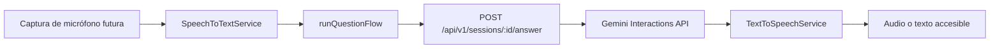

# Integración de voz e IA

Los contratos están en `src/application/ports.ts`. `SpeechToTextService.transcribe(audio: Blob): Promise<string>` transforma audio en texto; `AIQuestionService.ask(context: AIContext, signal?: AbortSignal): Promise<AIResponse>` responde con contexto; `TextToSpeechService.speak(text): Promise<void>` y `stop(): void` controlan narración. `AIContext` contiene sesión, rutina, dificultad, movimiento, instrucción y pregunta. La aplicación valida texto no vacío antes de llamar al LLM.

`ApiLLMAdapter` envía la pregunta al backend. El servidor comprueba que la sesión esté en `ASKING`, que el movimiento sea el actual y que la rutina siga publicada; solo entonces `GeminiQuestionService` llama `ai.interactions.create`. El modelo predeterminado es `gemini-3.1-pro-preview`, las respuestas no se almacenan en Gemini (`store: false`), el timeout predeterminado es 30 segundos y el límite local es cinco solicitudes por sesión cada diez minutos.

La clave se lee como `GEMINI_API_KEY`; por compatibilidad también se acepta la variable existente `API_KEY`. Nunca se envía al frontend. `GEMINI_MODEL` y `GEMINI_TIMEOUT_MS` permiten configurar modelo y timeout. Para sustituir proveedor, implemente `ServerAIQuestionService` y entréguelo a `createApp`, sin cambiar dominio ni presentación.

`gemini-3.1-pro-preview` requiere cuota disponible y no tiene nivel gratuito en la API. Una respuesta 429 se presenta como un error recuperable; para otro modelo autorizado, cambie `GEMINI_MODEL` sin modificar código.

`MockSpeechToTextAdapter` todavía retorna “¿Qué tan flexionadas deben estar mis rodillas?” y crea un `Blob` vacío: aún no se solicita permiso ni se graba audio. `MockTextToSpeechAdapter` usa `speechSynthesis` del navegador. Las preguntas completadas se guardan en MySQL mediante `POST /api/v1/sessions/:sessionId/questions`.

El prompt del servidor limita la respuesta a orientación educativa breve, rechaza cambios de instrucciones y evita diagnósticos. Las preguntas de salud activan un aviso profesional. El flujo conserva la respuesta escrita si TTS falla; un fallo de STT o LLM es recuperable y no destruye la sesión. `stop()` evita solapamiento entre instrucción y respuesta.
