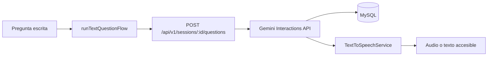

# Integración de voz e IA

Los contratos están en `src/application/ports.ts`. `AIQuestionService.ask(context: AIContext, signal?: AbortSignal): Promise<AIResponse>` responde con contexto; `TextToSpeechService.speak(text): Promise<void>` y `stop(): void` controlan narración. `AIContext` contiene sesión, rutina, dificultad, movimiento, instrucción y pregunta. La aplicación valida texto no vacío antes de llamar al LLM.

`ApiLLMAdapter` envía solo sesión, movimiento y pregunta. El servidor reconstruye el contexto confiable desde MySQL, comprueba que la sesión esté en `ASKING`, que el movimiento sea el actual y que la rutina siga publicada; solo entonces llama `ai.interactions.create` y persiste la respuesta del proveedor. El navegador nunca puede proporcionar el texto que se guarda como respuesta. El modelo predeterminado es el estable `gemini-3.5-flash`, las interacciones no se almacenan en Gemini (`store: false`), el timeout predeterminado es 30 segundos, los reintentos automáticos están desactivados para evitar esperas largas y el límite local es cinco solicitudes por sesión cada diez minutos.

La clave se lee como `GEMINI_API_KEY`; por compatibilidad también se acepta la variable existente `API_KEY`. Nunca se envía al frontend. `GEMINI_MODEL` y `GEMINI_TIMEOUT_MS` permiten configurar modelo y timeout. Para sustituir proveedor, implemente `ServerAIQuestionService` y entréguelo a `createApp`, sin cambiar dominio ni presentación.

Una respuesta 429 se presenta como un error recuperable. El servidor distingue entre un límite temporal (`AI_RATE_LIMITED`) y una cuota diaria agotada (`AI_DAILY_QUOTA_EXHAUSTED`), sin exponer detalles internos del proveedor. Las cuotas diarias de Gemini se aplican por proyecto y se reinician a medianoche, hora del Pacífico. Para usar otro modelo autorizado, cambie `GEMINI_MODEL` sin modificar código.

La entrada principal es un campo de texto accesible; no se solicita permiso ni se graba audio. `MockTextToSpeechAdapter` usa `speechSynthesis` del navegador como mejora progresiva. Las preguntas y respuestas completadas se guardan juntas en MySQL mediante `POST /api/v1/sessions/:sessionId/questions`.

El prompt del servidor limita la respuesta a orientación educativa breve, rechaza cambios de instrucciones y evita diagnósticos. Las preguntas de salud activan un aviso profesional. El flujo conserva la respuesta escrita si TTS falla; un fallo del LLM es recuperable y no destruye la sesión. `AbortController` y `stop()` cancelan solicitudes o narraciones al cerrar el panel.
