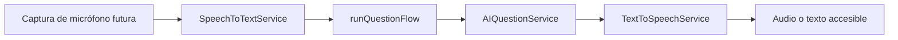

# Integración de voz e IA

Los contratos están en `src/application/ports.ts`. `SpeechToTextService.transcribe(audio: Blob): Promise<string>` transforma audio en texto; `AIQuestionService.ask(context: AIContext): Promise<AIResponse>` responde con contexto; `TextToSpeechService.speak(text): Promise<void>` y `stop(): void` controlan narración. `AIContext` contiene ID/nombre de rutina, dificultad, ID/nombre/instrucción del movimiento y pregunta. La aplicación valida texto no vacío antes de llamar al LLM.

En el MVP, `MockSpeechToTextAdapter` retorna “¿Qué tan flexionadas deben estar mis rodillas?”, `MockLLMAdapter` da una respuesta contextual segura y `MockTextToSpeechAdapter` usa `speechSynthesis` si existe, con resolución simulada si no. Los tiempos están en `src/infrastructure/ai/mockTiming.ts`. Se crea un `Blob` vacío porque la captura es demostrativa; no se solicita permiso ni se graba audio. Esto debe estar claro para no confundir al usuario.

Para sustituir un proveedor: implemente el puerto en `src/infrastructure/ai`, configure claves y proxy solo en el futuro backend, y cambie la instancia en `src/app/services.ts`. Mantenga las credenciales fuera del frontend. Añada cancelación, timeout, límites de tamaño, consentimiento de micrófono, política de retención y tests contractuales. Las respuestas con posible contenido médico deben pasar por la política de seguridad del producto; la interfaz ya muestra un aviso. Ejemplos de nombres posibles: `OpenAISpeechAdapter`, `GeminiLLMAdapter`, `AzureSpeechAdapter`; ninguno existe en este MVP. Las preguntas completadas se guardan en la sesión mediante `POST /api/v1/sessions/:sessionId/questions`.

El flujo conserva la respuesta escrita si TTS falla. Un fallo de STT o LLM se transforma en mensaje recuperable; el motor de sesión no se destruye. `stop()` evita solapamiento entre instrucción y respuesta.
