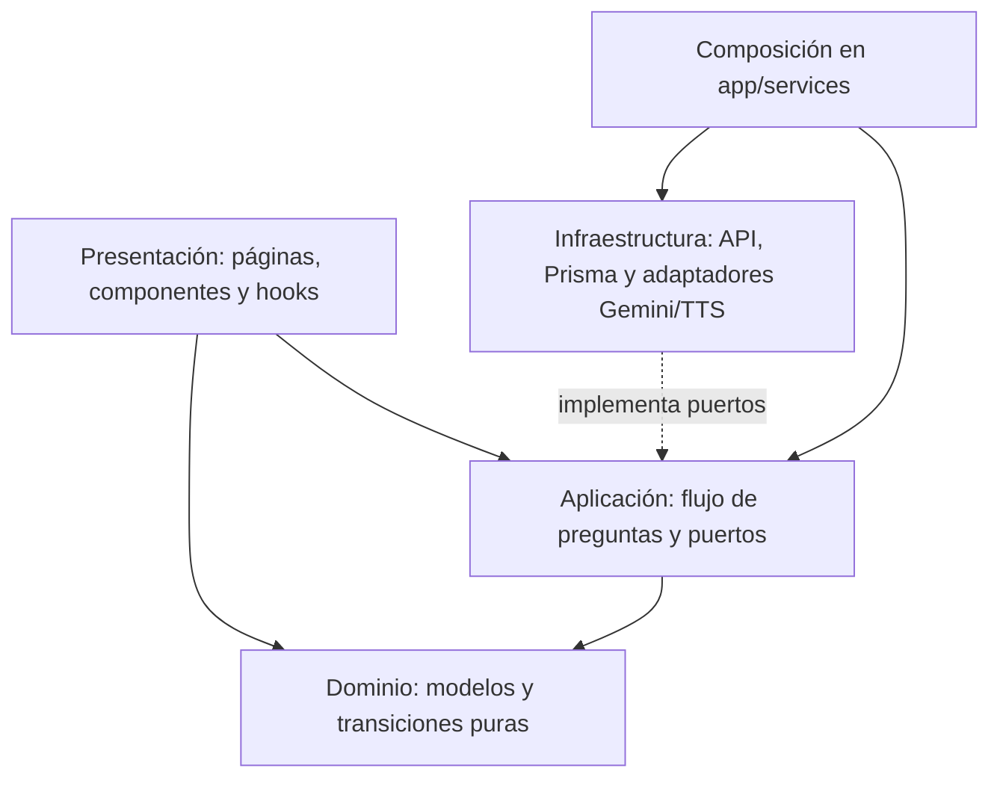
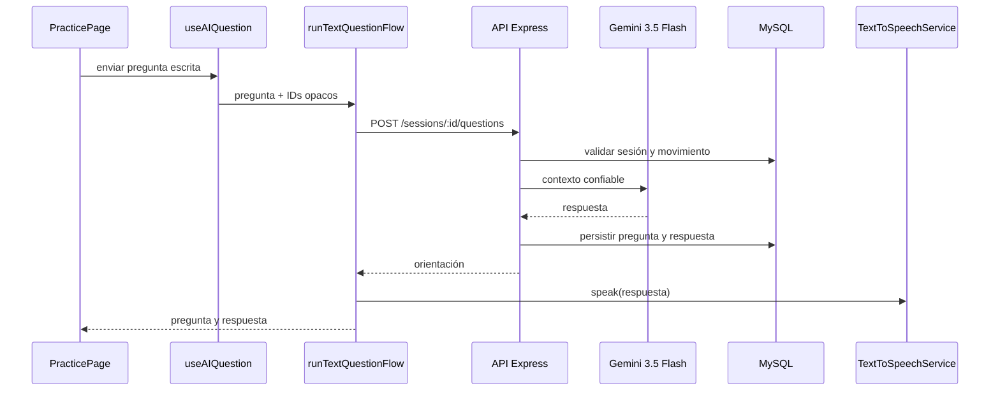

# Arquitectura

Se usa una separación ligera de cuatro capas. La regla es mantener las transiciones y modelos independientes de React, y reunir las dependencias externas detrás de puertos. No se introduce un framework de inyección: `src/app/services.ts` compone las implementaciones una vez.

El dominio no importa React ni APIs del navegador. `sessionMachine.ts` valida acciones y preserva invariantes; puede probarse con datos simples. Aplicación define `AIQuestionService`, `TextToSpeechService` y la secuencia `runTextQuestionFlow`; el puerto STT queda disponible para una fase de voz futura. Infraestructura implementa esos contratos. Presentación utiliza un contexto solo para compartir sesión entre rutas de práctica y resumen; los controles visuales reciben propiedades y no conocen proveedores.

## Decisiones

- Context API y `useReducer` bastan para una sesión activa. No hay necesidad de Zustand/Redux.
- React Router declarativo mantiene rutas legibles y evita introducir un framework de servidor.
- CSS dividido por responsabilidad y tokens compartidos permite un diseño consistente sin biblioteca de componentes.
- `ApiLLMAdapter` mantiene a React ajeno a Gemini; la clave y el prompt del sistema viven solo en Express.
- `speechSynthesis` del navegador es una mejora progresiva: su fallo no bloquea texto ni navegación.
- Express y Prisma persisten rutinas, sesiones anónimas y preguntas; el frontend conserva solo un `sessionId` opaco en `localStorage`.
- MySQL se consume como servicio administrado y las migraciones son versionadas con Prisma.

La inversión de dependencias se aplica en los puertos de aplicación; la composición inyecta adaptadores. Responsabilidad única: el motor modifica estado, el flujo coordina IA, las páginas componen experiencia. DRY se aplica a tokens y componentes de acciones; se evita una jerarquía genérica que complique el MVP.
