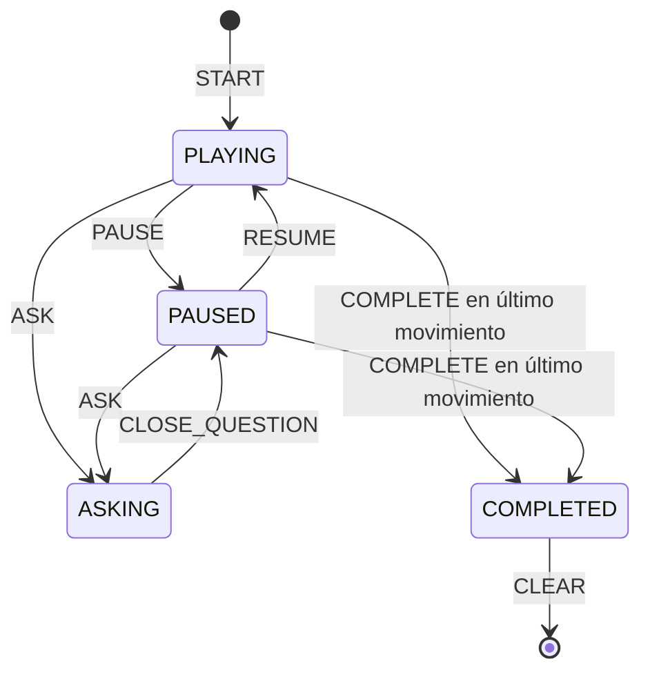

# Gestión de estado

Una única sesión activa se comparte entre práctica y resumen mediante `SessionProvider` (`useReducer`). El catálogo y las sesiones se consultan mediante TanStack Query y la API REST. El panel de IA tiene estado local en `useAIQuestion`, mientras que el backend genera y persiste cada pregunta completada y después el contexto refresca la sesión remota. El servidor calcula el tiempo activo al consultar o cambiar de estado; el intervalo local solo actualiza la presentación del reloj.

`NEXT` y `PREVIOUS` solo se aceptan en reproducción o pausa y verifican límites. `COMPLETE` solo se acepta en último movimiento. `TICK` no opera en pausa, pregunta ni completado. Las preguntas se vinculan en el servidor al movimiento actual. Acciones inválidas devuelven el estado sin cambio; esto evita combinaciones de booleanos incompatibles. La pregunta escrita sigue `IDLE → THINKING → SPEAKING → COMPLETED`, con transición recuperable a `ERROR`. Cerrar cancela la solicitud o reproducción y vuelve a `PAUSED`.

El identificador opaco de la sesión se guarda en `localStorage`; recargar recupera la sesión desde la API. La Fase 6 deberá añadir cuentas, historial visible, versión de esquema y política de sincronización para varios dispositivos.

El flujo de pregunta usa `AbortController`: al cerrar o reintentar se invalida la ejecución previa antes de la siguiente llamada al proveedor. `stop()` detiene cualquier narración pendiente.
