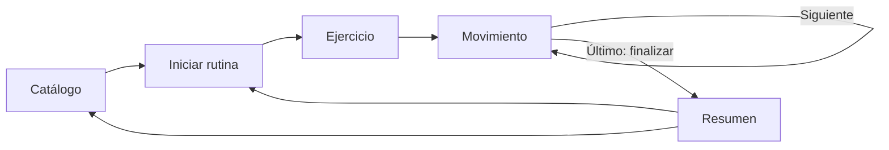
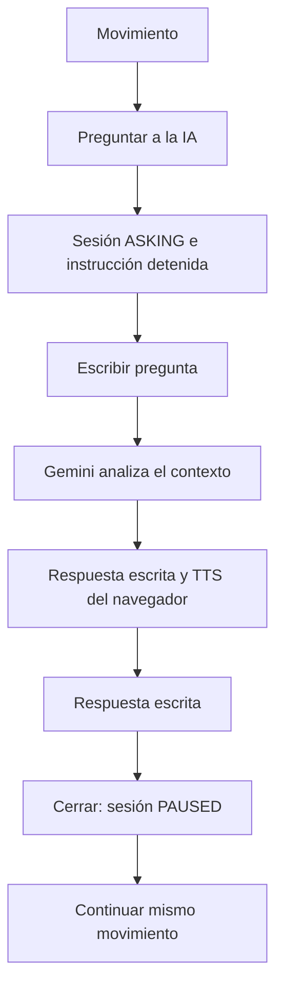

# Flujos de usuario

La selección crea una sesión persistida en MySQL y abre el primer movimiento. El usuario controla el avance manualmente; no hay avance automático. En la última tarjeta, la acción “Finalizar práctica” cierra la sesión y abre el resumen.

El usuario escribe una pregunta real sobre el movimiento actual. Gemini recibe contexto validado por el servidor y la pregunta/respuesta se guarda en la sesión. La tarjeta permite repetir la narración. Cerrar conserva movimiento y tiempo; “Continuar rutina” reanuda. Si la respuesta falla, el texto permanece editable para reintentar. Si falla TTS, la respuesta escrita se mantiene y se comunica el fallo de audio.

## Otros recorridos

- **Pausa y continuar:** `PLAYING → PAUSED → PLAYING`; la guía se cancela al pausar y reinicia desde la primera frase del movimiento al continuar.
- **Repetir:** vuelve a solicitar lectura de la instrucción actual sin tocar índice, progreso o tiempo.
- **Regresar:** retrocede un movimiento si existe; el tiempo total no se reinicia.
- **Abandonar:** acción explícita desde práctica, con confirmación del navegador; se limpia sesión y se vuelve al catálogo.
- **Entrada vacía:** el botón permanece deshabilitado y no se llama al proveedor.
- **LLM fallido o sin cuota:** mensaje claro del backend, sesión en `ASKING`, se puede editar, reintentar o cerrar.
- **TTS fallido:** mostrar respuesta y aviso; seguir con texto.
- **Ruta inválida:** mensaje y enlace a rutinas; una ruta de práctica sin sesión redirige al catálogo.
