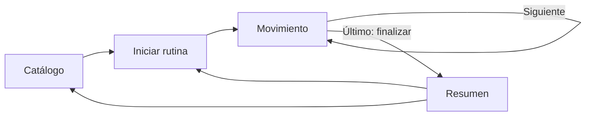
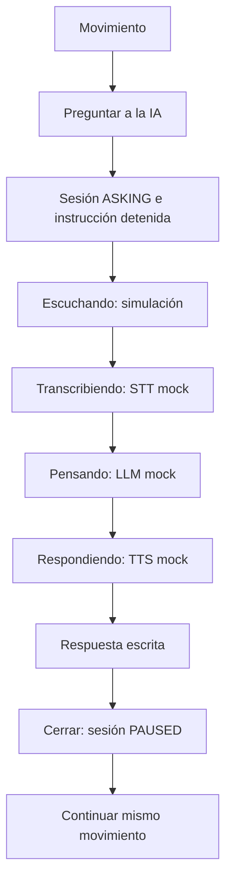

# Flujos de usuario

La selección crea una sesión persistida en MySQL y abre el primer movimiento. El usuario controla el avance manualmente; no hay avance automático. En la última tarjeta, la acción “Finalizar práctica” cierra la sesión y abre el resumen.

La pregunta mock es editable mediante adaptadores, pero la demostración usa un texto fijo. La tarjeta de respuesta permite repetir su narración. Cerrar conserva movimiento y tiempo; “Continuar rutina” reanuda. Si la transcripción o respuesta falla, se muestra error dentro del panel y se permite cerrar o reintentar. Si falla TTS, la respuesta escrita se mantiene y se comunica el fallo de audio.

## Otros recorridos

- **Pausa y continuar:** `PLAYING → PAUSED → PLAYING`; la instrucción se detiene al pausar y se vuelve a leer al continuar.
- **Repetir:** vuelve a solicitar lectura de la instrucción actual sin tocar índice, progreso o tiempo.
- **Regresar:** retrocede un movimiento si existe; el tiempo total no se reinicia.
- **Abandonar:** acción explícita desde práctica, con confirmación del navegador; se limpia sesión y se vuelve al catálogo.
- **Micrófono no disponible/permiso denegado:** el mock no usa micrófono. El flujo ya traduce `NotFoundError` y `NotAllowedError` a mensajes recuperables; al integrar captura real, la sesión permanece en la pregunta hasta que se cierre o reintente.
- **STT o LLM fallido:** mensaje claro, sesión en `ASKING`, se puede reintentar o cerrar.
- **TTS fallido:** mostrar respuesta y aviso; seguir con texto.
- **Ruta inválida:** mensaje y enlace a rutinas; una ruta de práctica sin sesión redirige al catálogo.
