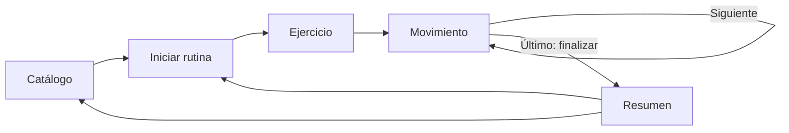
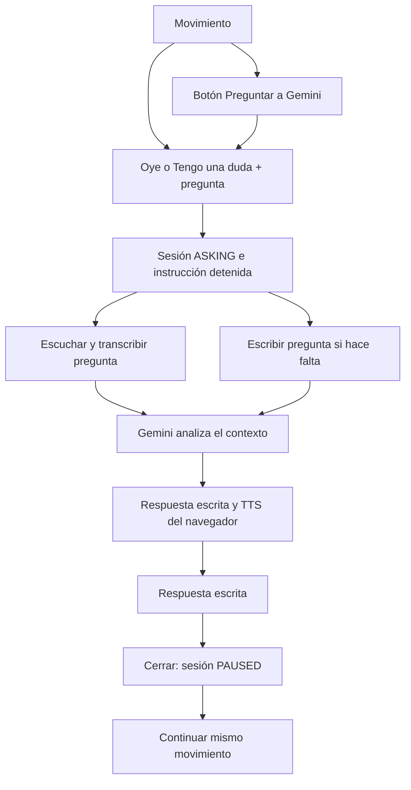

# Flujos de usuario

```mermaid
flowchart LR
  A[Catálogo] --> B[Iniciar rutina]
  B --> E[Ejercicio]
  E --> C[Movimiento]
  C -->|Siguiente| C
  C -->|Último: finalizar| D[Resumen]
  D --> A
  D --> B
```

La selección crea una sesión persistida en MySQL y abre el primer movimiento. El usuario controla el avance con botones o con las palabras aisladas «Pausar», «Continuar», «Repetir», «Siguiente» y «Anterior»; no hay avance automático. En la última tarjeta, “Siguiente” finaliza la práctica y abre el resumen.

```mermaid
flowchart TD
  M[Movimiento] --> Q[Oye o Tengo una duda + pregunta]
  M --> B[Botón Preguntar a Gemini]
  B --> Q
  Q --> P[Sesión ASKING e instrucción detenida]
  P --> V[Escuchar y transcribir pregunta]
  P --> E[Escribir pregunta si hace falta]
  V --> H[Gemini analiza el contexto]
  E --> H[Gemini analiza el contexto]
  H --> S[Respuesta escrita y TTS del navegador]
  S --> R[Respuesta escrita]
  R --> C[Cerrar: sesión PAUSED]
  C --> K[Continuar mismo movimiento]
```

El usuario dice «Oye» o «Tengo una duda» seguido de su pregunta; el navegador la transcribe y la envía a Gemini automáticamente. Una activación aislada espera la pregunta durante diez segundos. Puede usar el botón, detener la escucha o escribir si el micrófono falla. Mientras Gemini procesa y narra, se pausan la guía y la escucha de comandos. Al terminar, «Continuar» por voz cierra el panel y reanuda la rutina. Gemini recibe contexto validado por el servidor y la pregunta/respuesta se guarda en la sesión. La tarjeta permite repetir la narración. Cerrar conserva movimiento y tiempo. Si la respuesta falla, el texto permanece editable para reintentar. Si falla TTS, la respuesta escrita se mantiene y se comunica el fallo de audio.

## Otros recorridos

- **Pausa y continuar:** `PLAYING → PAUSED → PLAYING`; la guía se cancela al pausar y reinicia desde la primera frase del movimiento al continuar.
- **Repetir:** vuelve a solicitar lectura de la instrucción actual sin tocar índice, progreso o tiempo.
- **Regresar:** retrocede un movimiento si existe; el tiempo total no se reinicia.
- **Abandonar:** acción explícita desde práctica, con confirmación del navegador; se limpia sesión y se vuelve al catálogo.
- **Entrada vacía:** el botón permanece deshabilitado y no se llama al proveedor.
- **LLM fallido o sin cuota:** mensaje claro del backend, sesión en `ASKING`, se puede editar, reintentar o cerrar.
- **TTS fallido:** mostrar respuesta y aviso; seguir con texto.
- **Ruta inválida:** mensaje y enlace a rutinas; una ruta de práctica sin sesión redirige al catálogo.
